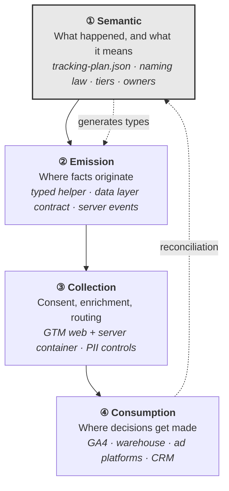

# GTM Architecture

**A reference architecture for product and marketing measurement.** Event taxonomies, data layer contracts, GTM container structure, audit instruments, and the governance that keeps all of it correct after the person who built it has moved on.

Not a tutorial. A working system, extracted from real implementations and generalised.

---

## Why this exists

Most measurement estates fail the same way. Not dramatically — quietly.

A container reaches two hundred tags. Nobody can say what half of them do. A redesign breaks a conversion metric and it takes three weeks to notice. Revenue in the analytics stack is twelve percent below the billing system and nobody can explain the gap, so gradually people stop citing the number in meetings. The taxonomy grows to four hundred events, of which twelve get used. Consent was retrofitted in a hurry against a legal deadline and nobody is confident it is right.

None of that is a tooling problem. Every one of those failures is an **architecture** problem, and architecture problems have to be solved before the first tag is written.

This repository is that architecture.

---

## The model

Four layers. Most estates fail because they conflate two of them.



The dotted lines are the architecture. Layer ① does not *describe* layer ②; it **generates the types layer ② is compiled against**. Layer ④ does not just consume; it **reconciles back** against the source of record. Without those two loops you have documentation, which drifts, instead of a contract, which cannot.

---

## What is in here

| | |
|---|---|
| **[`/philosophy`](philosophy/)** | The reasoning. Fourteen principles, a method for designing events, and the case for collecting less |
| **[`/event-taxonomy`](event-taxonomy/)** | The naming law, and complete catalogues for product, marketing, onboarding and feature usage |
| **[`/data-layer`](data-layer/)** | Three JSON Schemas and the implementation contract between frontend, backend and measurement |
| **[`/gtm-templates`](gtm-templates/)** | Container structure, a four-gate QA process, a 96-point audit checklist, and reference flow diagrams |
| **[`/audits`](audits/)** | A client-ready audit report template, 24 failure patterns, and 18 changes that take under a day |
| **[`/examples`](examples/)** | One fictional company, worked end to end: 38 events, 41 tags, and the arithmetic showing why not 400 |
| **[`/governance`](governance/)** | The RFC template, ownership model, and versioning rules that make it survive |
| **[`/tooling`](tooling/)** | The machine-readable plan, a validator, a TypeScript generator, and a link checker. Zero dependencies |

### Start here

**A founder or PM** wondering whether the numbers can be trusted → [Quick wins](audits/quick-wins.md), then [Common risks](audits/common-risks.md).

**An engineer** implementing tracking → [Data layer naming rules](data-layer/naming-rules.md), then [`saas-schema.json`](data-layer/saas-schema.json).

**An analyst or architect** designing a taxonomy → [How to think about events](philosophy/how-to-think-about-events.md), then [the worked example](examples/example-event-taxonomy.md).

**Anyone deciding whether to work with me** → [Tracking principles](philosophy/tracking-principles.md). It is the shortest thing here and it says the most.

---

## The plan is code

The centre of this architecture is [`tooling/tracking-plan.json`](tooling/tracking-plan.json) — events, properties, tiers, owners, enums, monitoring rules and versioned business definitions in one machine-readable file.

```bash
make check          # validate, parse schemas, resolve every doc link
make validate       # just the plan
make types          # TypeScript from the plan
```

```
Tracking plan validation

  events              25
    tier 0            9
    tier 1            10
    tier 2            5
    tier 3            1
    deprecated        1
  enums               44
  features            5
  GA4 dimensions      29/30 event-scoped · 2/15 user-scoped

PASSED with 2 warnings
```

The validator enforces what a JSON Schema cannot: verb vocabulary, PII heuristics, `*_id` must be a string, money must have a currency sibling, Tier 0 cannot be client-only, Tier 3 must expire, unbounded properties must not become GA4 dimensions, and activation definitions must be versioned with a stated derivation.

It runs on every pull request. **A convention that is not enforced is a preference.**

---

## Six ideas that do most of the work

**Design from the decision backwards.** `Decision → Question → Metric → Event`. Run it in that direction. If you cannot name the decision, you are not designing measurement, you are producing exhaust.

**One event, many properties. Never many events.** Five export events become one with two dimensions. Nineteen integration events become one with a slug. Eighteen onboarding events become four. Nothing is lost, and adding the twentieth integration then requires no change at all.

**Tier by consequence.** Tier 0 reconciles against money and is collected server-side, monitored hourly, and paged on. Tier 3 is experimental and deletes itself in ninety days. Pretending everything deserves the same rigour means either over-engineering everything or protecting nothing.

**Names are immutable; meaning is versioned.** Once an event has been in production for a reporting cycle it is a public API. Changing what it counts requires a new name and a dual-run window — never a version suffix, never a silent redefinition.

**Consent is an input to the architecture, not a banner on top of it.** Defaults resolve before the first tag evaluates. Every tag declares its own requirements. Denied consent is *measured*, not invisible.

**Events expire.** Default TTL on an experiment is ninety days. Tracking plans do not shrink on their own, and the annual question is always the same: *show me the decision this changed.*

Full set: [Tracking principles](philosophy/tracking-principles.md).

---

## Using this on a real project

**Week 1 — establish the truth.** Reconcile one Tier 0 event against the source of record. Run the ad-blocker test. Query for zombie events. That reconciliation number is what turns "our tracking is a bit messy" into a decision with a budget attached.

**Weeks 2–4 — foundations.** Consent architecture, the data layer contract, server-side collection for everything that touches money. Everything else depends on these, and retrofitting any of them costs an order of magnitude more.

**Weeks 5–8 — taxonomy.** Design from the metrics tree. Consolidate the name explosions. Dual-run, then deprecate.

**Weeks 9–12 — governance.** Owners, monitoring, QA gates, the RFC process. Without this phase the estate degrades back to where it started within eighteen months — and that is not a prediction, it is the observed default.

Sequenced in full in [the audit report template](audits/gtm-audit-template.md#5-remediation-plan).

---

## Conventions in this repository

- Every mechanical rule is enforced in CI. Where it is not, that is a gap, not a style choice.
- Every document links to the ones it depends on, and every link is checked.
- Platform limits carry the date they were verified. They move; re-check before designing against a ceiling.
- The worked example is fictional. No client data, no client names, nothing under NDA.
- Numbers presented as observed — retention gaps, loss rates, distributions — are illustrative unless a source is cited.

---

## About

I design measurement architecture for product-led companies: event taxonomies, data layer contracts, GTM and server-side implementations, and the governance that keeps them trustworthy.

The work I care about is the part before the tags — deciding what is worth measuring, naming it so it survives the next redesign, and building the enforcement that stops it decaying. Most tracking problems are not tooling problems.

**Hanne Broeckx** — Belgium

> Open to architecture engagements, audits, and fractional analytics leadership.
> Reach me through the contact links on my GitHub profile.

---

## Licence

[MIT](LICENSE). Use it, adapt it, ship it in client work. Attribution appreciated, not required.
