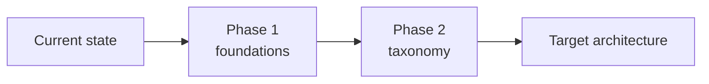

# GTM Audit — Report Template

The deliverable. Fill it in, delete the guidance in `>` blocks, and ship.

The instrument that produces the findings is [`../gtm-templates/audit-checklist.md`](../gtm-templates/audit-checklist.md). This document is how the findings become a decision.

> **How to use this template.** Write the executive summary last and make it standalone — most of the audience will read only that page. Every finding needs evidence, and the remediation plan is the part the client actually pays for. An audit that lists problems without a sequenced plan is a complaint.

---

# Measurement Architecture Audit
## `<Client name>`

| | |
|---|---|
| **Prepared for** | `<name, role>` |
| **Prepared by** | `<your name>` |
| **Audit period** | `<start> – <end>` |
| **Data window examined** | `<90 days: YYYY-MM-DD to YYYY-MM-DD>` |
| **Systems in scope** | GTM `<container ID>` · GA4 `<property ID>` · `<server container>` · `<ad platforms>` · `<CMP>` |
| **Out of scope** | `<explicitly listed>` |
| **Version** | 1.0 |

---

## 1. Executive summary

> One page. No jargon. Written for someone who will not read section 4.

**Overall score: `<n>`/100 — `<Mature / Solid / Fragile / Unreliable / Rebuild>`**

`<Two or three sentences: the current state, the single most important consequence, and the recommended direction. Name the business impact, not the technical symptom. "Paid acquisition decisions are being made on conversion data that undercounts by roughly 30%" beats "server-side tagging is not implemented".>`

### Headline findings

| # | Finding | Severity | Business impact |
|---|---|---|---|
| 1 | `<finding>` | P0 | `<quantified where possible>` |
| 2 | `<finding>` | P0 | |
| 3 | `<finding>` | P1 | |
| 4 | `<finding>` | P1 | |
| 5 | `<finding>` | P1 | |

### Domain scores

| Domain | Score | Weight | Verdict |
|---|---|---|---|
| Privacy & consent | `<n>`/100 | 20% | |
| Event taxonomy | `<n>`/100 | 15% | |
| Data quality | `<n>`/100 | 15% | |
| Data layer | `<n>`/100 | 12% | |
| GA4 configuration | `<n>`/100 | 12% | |
| Server-side & advertising | `<n>`/100 | 10% | |
| Governance | `<n>`/100 | 8% | |
| Container hygiene | `<n>`/100 | 5% | |
| Performance | `<n>`/100 | 3% | |
| **Weighted total** | **`<n>`/100** | | |

> Any P0 finding caps the total at 40 regardless of the weighted score. State the cap explicitly if it applies.

### Recommendation

`<One paragraph. Remediate, rebuild, or targeted intervention. If rebuild: say why remediation costs more, with the arithmetic.>`

---

## 2. What is working

> Never skip this section. It is not diplomacy — it identifies the foundations you will build the remediation on, and it tells the client which of their existing investments to protect.

| Area | Observation | Why it matters |
|---|---|---|
| | | |

---

## 3. Method

| | |
|---|---|
| **Checks executed** | `<n>` of 96 applicable |
| **User journeys traced** | `<n>` end to end, across `<n>` consent states |
| **Data window** | `<n>` days |
| **Tools** | GTM Preview · GA4 DebugView · BigQuery · `<CMP admin>` · Chrome DevTools · ad-blocker test profile |
| **Access granted** | `<list>` |
| **Limitations** | `<what could not be verified, and what that means for confidence in the findings>` |

> Declare limitations honestly. "We could not verify the server container because access was not granted" belongs in the report, not in a footnote.

---

## 4. Findings

> One block per finding. Ordered by severity, then business impact. Evidence is mandatory — a finding without evidence is an opinion.

### F-01 · `<Short title>`

| | |
|---|---|
| **Severity** | P0 |
| **Domain** | Privacy & consent |
| **Check reference** | 2.3 |
| **Status** | Open |

**Observation**
`<What is happening. Factual, specific, no adjectives.>`

**Evidence**
```
<Network request, dataLayer object, query result, screenshot reference.
 Reproducible: state the exact steps.>
```

**Mechanism**
`<Why it happens. The technical cause, not the symptom.>`

**Impact**
`<Business consequence, quantified. "€X of monthly ad spend is being optimised against
 a conversion signal that undercounts by Y%." If you cannot quantify it, say what
 decision it distorts and by roughly how much.>`

**Remediation**
`<Specific. "Move the consent default tag to the Consent Initialization trigger at
 priority 1000" — not "review consent implementation".>`

| Effort | Owner | Dependency | Target |
|---|---|---|---|
| `<S / M / L — days>` | `<role>` | `<blocker or none>` | `<date>` |

---

### F-02 · `<Short title>`

> Repeat the block. Ten to twenty findings is typical for a first audit. More than thirty means you are reporting noise; consolidate.

---

## 5. Remediation plan

> The section that turns an audit into a project. Sequenced by dependency, not by severity — you cannot fix taxonomy before you fix the data layer that carries it.

### Phase 0 — Stop the bleeding · week 1

| # | Action | Finding | Effort | Owner |
|---|---|---|---|---|
| 1 | | F-01 | | |

`<Everything with legal exposure or active revenue misreporting. No dependencies allowed in this phase — if it needs something else first, it is not Phase 0.>`

### Phase 1 — Foundations · weeks 2–4

| # | Action | Finding | Effort | Owner |
|---|---|---|---|---|

`<Data layer, consent architecture, server-side collection for Tier 0. Everything else depends on these.>`

### Phase 2 — Taxonomy · weeks 5–8

| # | Action | Finding | Effort | Owner |
|---|---|---|---|---|

`<Event redesign, naming migration, dual-running periods, deprecations.>`

### Phase 3 — Governance · weeks 9–12

| # | Action | Finding | Effort | Owner |
|---|---|---|---|---|

`<Ownership, monitoring, QA gates, the change process. Without this phase the estate degrades back to its audited state within 18 months. Say that in the report.>`

### Effort summary

| Phase | Engineering | Analytics | Elapsed |
|---|---|---|---|
| 0 | `<n>` days | `<n>` days | 1 week |
| 1 | | | 3 weeks |
| 2 | | | 4 weeks |
| 3 | | | 4 weeks |
| **Total** | | | **12 weeks** |

---

## 6. Quick wins

> Pulled from [`quick-wins.md`](quick-wins.md). Filtered to what applies here. These build the credibility that funds Phases 1–3.

| # | Action | Effort | Impact |
|---|---|---|---|
| 1 | | < 1 h | |
| 2 | | < 1 h | |
| 3 | | < 1 d | |

---

## 7. Target architecture

> A diagram of where they should end up. Adapt from [`../gtm-templates/tag-flow-diagram.md`](../gtm-templates/tag-flow-diagram.md). One diagram, annotated with what changes.



---

## 8. Risk register

> What happens if nothing changes. Written for the person who has to approve the budget.

| Risk | Likelihood | Impact | If unaddressed |
|---|---|---|---|
| Regulatory finding on consent implementation | | | |
| Paid media optimised on understated conversions | | | |
| Taxonomy rebuild forced by the next redesign | | | |
| Key-person dependency on undocumented container | | | |

---

## 9. Appendices

**A — Full checklist results.** All 96 checks with pass/fail and evidence references.
**B — Event inventory.** Every event currently firing, with 30-day volume, owner (or "none"), and a keep / merge / delete recommendation.
**C — Container inventory.** Tags, triggers, variables, with last-fired dates.
**D — Consent matrix test results.** Four states × `<n>` journeys, with network evidence.
**E — Reconciliation.** Tier 0 events against the source of record, by month.

---

> **Closing note for the analyst writing this.** The value of an audit is not the list of problems — the client already suspects most of them. The value is the sequencing: knowing which fix unblocks which, what can wait, and what will break again in a year without governance. Spend your time on section 5.

---

**See also:** [Audit checklist](../gtm-templates/audit-checklist.md) · [Common risks](common-risks.md) · [Quick wins](quick-wins.md)
