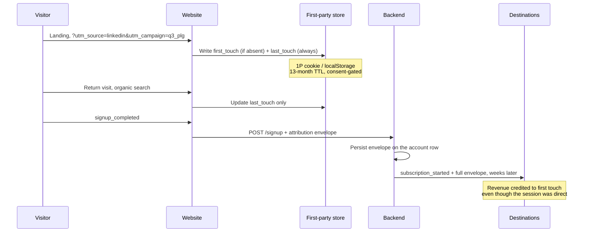

# Marketing Events

Everything that happens before the product does: acquisition, content, forms, campaigns, and the attribution envelope that carries context across the boundary.

The design constraint that shapes this entire file: **marketing events are the most consent-sensitive and the most adversarially-collected surface you own.** Ad blockers, ITP, and consent denial all hit hardest here. Architect for degradation, not for the happy path.

---

## The attribution envelope

Attribution is not an event. It is a **stored context object** captured at first touch, persisted, and attached server-side to conversion events later. Re-deriving attribution at conversion time from the current referrer is the most common attribution bug in existence, and it silently over-credits direct and branded search.

**Envelope contents** — captured once, carried forever:

| Field | Type | Notes |
|---|---|---|
| `first_touch_source` / `_medium` / `_campaign` / `_content` / `_term` | string | Set once; never overwritten |
| `first_touch_at` | string | ISO 8601 UTC |
| `first_touch_landing_page` | string | Path only, query stripped |
| `first_touch_referrer_domain` | string | Domain, not full URL |
| `last_touch_source` / `_medium` / `_campaign` | string | Overwritten every session with a non-direct source |
| `last_touch_at` | string | ISO 8601 UTC |
| `session_count_before_conversion` | integer | |
| `days_to_conversion` | integer | First touch → conversion |
| `click_id` | string | `gclid` · `wbraid` · `gbraid` · `fbclid` · `li_fat_id` · `msclkid`. **Ads consent required** |
| `click_id_type` | enum | Which platform the click ID belongs to |

**Rules:**
1. First touch is immutable. Last touch is overwritten. Store both; let the model decide later.
2. Direct traffic never overwrites last touch. A direct return visit is not a new touchpoint.
3. Self-referrals never overwrite anything. Add every owned domain to the referral exclusion list *and* to your own capture logic.
4. Click IDs are written only when `ad_storage` is granted, and are attached server-side at conversion.
5. The envelope is persisted on the **account** row, not just the user row. In B2B, the person who converts is frequently not the person who first landed.

---

## 1. Page and content engagement

### `page_view`
**Tier 1 · Src C · Owner: Marketing Ops**
The one event where GA4's automatic collection is genuinely the right answer. Enhance it; do not replace it.

| Property | Type | Req | Values / notes |
|---|---|---|---|
| `page_type` | enum | ✓ | `home` · `pricing` · `product` · `blog` · `docs` · `case_study` · `comparison` · `legal` · `careers` · `app` |
| `page_template` | string | ✓ | CMS template identifier — survives URL restructures |
| `content_group` | string | – | Primary topical grouping |
| `is_authenticated` | boolean | ✓ | Splits marketing site from product in one dimension |
| `experiment_variants` | string | – | Comma-joined `experiment_id:variant_id` pairs |

**`page_type` is the highest-leverage property in the entire marketing plan.** It survives redesigns, URL migrations, and internationalisation, all of which destroy path-based reporting.

### `content_engaged`
**Tier 2 · Src C · Owner: Content**
Replaces scroll-depth and time-on-page as *separate* events. One qualified engagement per page view, fired when meaningful consumption is confirmed.

| Property | Type | Req | Values / notes |
|---|---|---|---|
| `engagement_trigger` | enum | ✓ | `scroll_75` · `dwell_45s` · `video_50pct` · `interaction` |
| `content_id` | string | ✓ | CMS identifier |
| `content_type` | enum | ✓ | `article` · `guide` · `case_study` · `video` · `webinar` · `docs` |
| `content_topic` | enum | ✓ | Closed taxonomy of ~10 topics |
| `scroll_depth_pct` | integer | ✓ | 0–100 at fire time |
| `time_on_page_s` | integer | ✓ | Active time, not wall clock |
| `word_count` | integer | – | Enables normalised engagement across long and short content |

Firing scroll milestones at 25/50/75/90 produces four events per pageview and answers no question that one qualified engagement event does not. Do not.

### `video_engaged`
**Tier 2 · Src C · Owner: Content**
Carries `video_id`, `video_title_slug`, `video_provider`, `video_duration_s`, `milestone_pct` (10 · 25 · 50 · 75 · 100), `is_autoplay`, `playback_surface`.

---

## 2. Conversion actions

### `lead_captured`
**Tier 0 · Src S · Owner: Marketing Ops**
The marketing site's revenue-adjacent event. Server-side because it must reconcile with the CRM, and because client-side form tracking loses 15–30% to blockers.

| Property | Type | Req | Values / notes |
|---|---|---|---|
| `lead_id` | string | ✓ | CRM identifier once created |
| `form_id` | string | ✓ | |
| `form_type` | enum | ✓ | `demo_request` · `contact` · `content_download` · `newsletter` · `webinar` · `pricing_enquiry` · `trial_request` |
| `form_surface` | enum | ✓ | `landing_page` · `inline_content` · `modal` · `footer` · `chat` · `sidebar` |
| `lead_source_detail` | string | – | Campaign-level detail beyond `utm_campaign` |
| `email_domain_type` | enum | ✓ | `business` · `freemail` · `edu` · `disposable`. **Classification only** |
| `company_size_band` | enum | – | `1_10` · `11_50` · `51_200` · `201_1000` · `1000_plus` |
| `is_marketing_qualified` | boolean | ✓ | Result of the scoring model at capture time |
| `gated_asset_id` | string | – | Required when `form_type = content_download` |

**Never in this event:** email address, name, phone, job title free-text, message body. Those go from your form handler to your CRM directly, server to server, never through the data layer or an analytics destination.

### `form_started` / `form_abandoned`
**Tier 2 · Src C · Owner: Marketing Ops**
`form_started` fires on first field interaction — not on render. `form_abandoned` fires on unload with an incomplete form. Together they give you a field-level friction map that no aggregate conversion rate can produce.

| Property | Type | Req | Values / notes |
|---|---|---|---|
| `form_id` | string | ✓ | |
| `fields_completed_count` | integer | ✓ | |
| `fields_total_count` | integer | ✓ | |
| `last_field_touched` | string | ✓ | Field **name**, never its value |
| `time_in_form_s` | integer | ✓ | |
| `validation_error_count` | integer | ✓ | |

`last_field_touched` is the single most actionable property here. It is nearly always the phone number field.

### `demo_requested`
**Tier 0 · Src S · Owner: Revenue Ops**
Carries `lead_id`, `requested_slot_at`, `routing_segment`, `is_self_scheduled`, `qualification_score`, `account_matched` (boolean — whether the domain matched an existing account, which changes routing entirely).

### `cta_clicked`
**Tier 2 · Src C · Owner: Marketing Ops**
One event for every call to action on the estate. Requires a `data-analytics-id` attribute convention on the frontend — this is a contract with the engineering team, and it belongs in the component library, not in a GTM CSS selector that breaks on the next redesign.

| Property | Type | Req | Values / notes |
|---|---|---|---|
| `cta_id` | string | ✓ | From `data-analytics-id`. Stable across copy changes |
| `cta_label` | string | ✓ | Visible text at click time, ≤ 100 chars |
| `cta_location` | enum | ✓ | `hero` · `nav` · `inline` · `sticky` · `footer` · `modal` · `pricing_table` |
| `cta_destination` | string | ✓ | Path only |
| `cta_variant` | string | – | Experiment variant when under test |

**CSS-selector-based click tracking is technical debt with a redesign-shaped fuse.** The `data-analytics-id` contract costs the frontend team one attribute per CTA and eliminates the entire class of breakage.

---

## 3. Campaign & advertising

### `ad_conversion_reported`
**Tier 1 · Src S · Owner: Paid Media**
The server-side conversion emission — Google Ads Enhanced Conversions, Meta CAPI, LinkedIn CAPI. Logged as a first-party event so you can reconcile what you *sent* against what each platform *reports*, which is the only way to diagnose a platform-vs-analytics discrepancy.

| Property | Type | Req | Values / notes |
|---|---|---|---|
| `destination_platform` | enum | ✓ | `google_ads` · `meta` · `linkedin` · `microsoft` · `reddit` |
| `conversion_action_id` | string | ✓ | Platform-side identifier |
| `source_event_id` | string | ✓ | The `event_id` of the originating first-party event — this is the deduplication key |
| `match_keys_sent` | string | ✓ | Comma-joined key *names* only: `email_hash,phone_hash,click_id`. **Never the values** |
| `value` | number | – | |
| `currency` | string | – | |
| `consent_ads` | boolean | ✓ | Must be `true` for this event to exist at all |
| `dispatch_status` | enum | ✓ | `sent` · `rejected` · `retried` · `dropped_no_consent` |

### `email_engaged`
**Tier 2 · Src S · Owner: Lifecycle Marketing**
One event covering the email lifecycle. Open rates have been unreliable since Apple Mail Privacy Protection began pre-fetching images in 2021 — track opens if you must, but never build a metric or a trigger on them.

| Property | Type | Req | Values / notes |
|---|---|---|---|
| `email_engagement_type` | enum | ✓ | `delivered` · `opened` · `clicked` · `bounced` · `unsubscribed` · `spam_reported` |
| `campaign_id` | string | ✓ | |
| `campaign_type` | enum | ✓ | `lifecycle` · `newsletter` · `product_update` · `nurture` · `transactional` |
| `email_variant` | string | – | A/B variant |
| `link_id` | string | – | Required when type is `clicked` |
| `is_machine_open` | boolean | – | Best-effort MPP detection. If you cannot detect it, do not report opens |

### `experiment_exposed`
**Tier 1 · Src S+C · Owner: Growth**
Fires on **exposure**, never on assignment. Counting assignment instead of exposure inflates the denominator with users who never saw the variant and is the most common way an A/B test quietly lies to you.

| Property | Type | Req | Values / notes |
|---|---|---|---|
| `experiment_id` | string | ✓ | |
| `variant_id` | string | ✓ | |
| `experiment_surface` | enum | ✓ | |
| `assignment_unit` | enum | ✓ | `anonymous_id` · `user_id` · `account_id`. **In B2B this is almost always `account_id`** |

---

## 4. Consent

Consent state is data. It determines what every other row in your warehouse is allowed to mean.

### `consent_state_set`
**Tier 0 · Src C · Owner: Legal Ops / Marketing Ops**

| Property | Type | Req | Values / notes |
|---|---|---|---|
| `consent_action` | enum | ✓ | `default_applied` · `accept_all` · `reject_all` · `custom` · `withdrawn` · `restored` |
| `ad_storage` | enum | ✓ | `granted` · `denied` |
| `analytics_storage` | enum | ✓ | `granted` · `denied` |
| `ad_user_data` | enum | ✓ | `granted` · `denied` |
| `ad_personalization` | enum | ✓ | `granted` · `denied` |
| `functionality_storage` | enum | – | `granted` · `denied` |
| `personalization_storage` | enum | – | `granted` · `denied` |
| `security_storage` | enum | – | `granted` · `denied` |
| `cmp_version` | string | ✓ | The banner version that produced this state — you need it when a regulator asks |
| `region_rule` | string | ✓ | Which geographic rule set applied |
| `time_to_decision_s` | integer | – | Absent for `default_applied` |

`ad_storage`, `analytics_storage`, `ad_user_data` and `ad_personalization` are the four signals Google Consent Mode v2 requires. The remaining three are additional storage types GTM supports and are worth capturing for completeness.

**Architectural requirements:**
- Defaults are set **before** any measurement tag evaluates — highest-priority initialisation tag, `Consent Initialization` trigger.
- `analytics_storage: denied` means cookieless pings, not silence. Configure it deliberately.
- Every tag **declares** its required consent types. Nothing inherits.
- Consent state is snapshotted onto every event (`consent_analytics`, `consent_ads`) so downstream analysis can segment by it. Without this, denied-consent traffic is invisible rather than measured, and you will misread a consent shift as a traffic drop.

Full implementation flow: [`../gtm-templates/tag-flow-diagram.md`](../gtm-templates/tag-flow-diagram.md#consent-gate).

---

## Degradation model

Design for the modelled world, not the ideal one.

| Signal | Typical loss | Mitigation |
|---|---|---|
| Client-side JS (blockers) | 10–30% B2C, 5–15% B2B | Server-side collection for Tier 0 |
| Safari ITP cookie lifetime | 7 days for JS-set cookies | Server-set first-party cookies via a same-site endpoint |
| Consent denial (EU) | 20–50% | Consent Mode + modelling; measure the denied cohort's size explicitly |
| Third-party cookies | Deprecated in practice | First-party + server-side only |
| Email opens | Unreliable since MPP | Never build metrics on opens |
| Ad click IDs | Lost without ads consent | URL passthrough + server-side conversion APIs |

**The honest report to leadership names the collection rate.** "Signups are down 12%" and "measured signups are down 12% while consent grant rate fell 9 points" are different sentences, and only one of them is true.

---

**See also:** [Naming conventions](event-naming-conventions.md) · [Product events](product-events.md) · [Onboarding events](onboarding-events.md) · [Common risks](../audits/common-risks.md)
