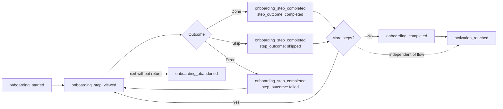

# Onboarding Events

Onboarding is the highest-leverage measurement surface in a PLG product and the one most commonly instrumented as a pile of `step_1_clicked` events that answer nothing.

This file specifies a **generic step model** that survives redesigns, and the activation framework that sits on top of it.

---

## The core idea: one event family, not one event per step

```
❌  onboarding_step_1_completed
    onboarding_step_2_completed
    onboarding_workspace_step_done
    onboarding_invite_step_skipped
    onboarding_step_3_completed_v2

✅  onboarding_step_completed
    ├─ flow_id
    ├─ step_id
    ├─ step_index
    └─ step_outcome: completed | skipped | failed
```

The generic model survives the redesign. The specific one requires a new tag, a new trigger, a new dimension and a broken historical comparison every time the product team reorders two screens — which they will, because reordering onboarding steps is the most common growth experiment there is.

---

## The step model



Note the last edge. **Activation is not the end of onboarding.** A user can finish every screen and never reach value; a user can skip the whole flow and activate on day one. Coupling them is how teams end up optimising a completion rate that does not move revenue.

---

## Event specifications

### `onboarding_started`
**Tier 1 · Src S+C · Owner: Growth PM**
Fires once per user per flow, when the first step renders.

| Property | Type | Req | Values / notes |
|---|---|---|---|
| `flow_id` | enum | ✓ | `initial_setup` · `workspace_setup` · `integration_setup` · `team_invite` · `feature_intro` |
| `flow_version` | string | ✓ | Increment on any structural change. Cohorts are compared within a version, never across |
| `step_count_total` | integer | ✓ | Steps in this version of the flow |
| `entry_point` | enum | ✓ | `post_signup` · `first_login` · `empty_state` · `nav_prompt` · `email_link` · `resumed` |
| `is_resumed` | boolean | ✓ | Returning to a partially completed flow |
| `persona_segment` | string | – | If the flow branches on a self-reported role |

### `onboarding_step_viewed`
**Tier 2 · Src C · Owner: Growth PM**
Fires each time a step renders, including re-renders after a failed attempt.

| Property | Type | Req | Values / notes |
|---|---|---|---|
| `flow_id` | enum | ✓ | |
| `flow_version` | string | ✓ | |
| `step_id` | enum | ✓ | Stable slug: `create_workspace`, `invite_team`, `connect_crm`, `import_data`, `set_goals` |
| `step_index` | integer | ✓ | 1-based position **in this flow version** |
| `is_optional` | boolean | ✓ | |
| `view_count` | integer | ✓ | Nth time this user has seen this step. `> 1` means a retry — the friction signal |

### `onboarding_step_completed`
**Tier 1 · Src S+C · Owner: Growth PM**
The workhorse. One event, three outcomes.

| Property | Type | Req | Values / notes |
|---|---|---|---|
| `flow_id` | enum | ✓ | |
| `flow_version` | string | ✓ | |
| `step_id` | enum | ✓ | |
| `step_index` | integer | ✓ | |
| `step_outcome` | enum | ✓ | `completed` · `skipped` · `failed` |
| `time_on_step_s` | integer | ✓ | Active time |
| `attempt_number` | integer | ✓ | |
| `failure_reason` | enum | – | Required when `step_outcome = failed` |
| `assistance_used` | enum | – | `tooltip` · `docs_link` · `chat` · `video` · `none` |

### `onboarding_completed`
**Tier 1 · Src S · Owner: Growth PM**

| Property | Type | Req | Values / notes |
|---|---|---|---|
| `flow_id` | enum | ✓ | |
| `flow_version` | string | ✓ | |
| `steps_completed_count` | integer | ✓ | |
| `steps_skipped_count` | integer | ✓ | |
| `total_duration_s` | integer | ✓ | Active time across all steps |
| `elapsed_since_start_s` | integer | ✓ | Wall clock — the gap between the two exposes multi-session flows |
| `session_count` | integer | ✓ | Sessions spanned |

### `onboarding_abandoned`
**Tier 1 · Src S · Owner: Growth PM**
Fires from a scheduled server-side job, not from the client. Abandonment is the *absence* of a signal, and the browser is not there to tell you about it.

| Property | Type | Req | Values / notes |
|---|---|---|---|
| `flow_id` | enum | ✓ | |
| `flow_version` | string | ✓ | |
| `last_step_id` | enum | ✓ | Where they stopped — the actionable field |
| `last_step_index` | integer | ✓ | |
| `completion_pct` | integer | ✓ | 0–100 |
| `abandonment_window_h` | integer | ✓ | Hours of inactivity that triggered the classification (default 72) |

Definition: no step event for the flow within the window. Document the window in the plan; changing it silently changes every historical abandonment rate.

### `activation_reached`
**Tier 0 · Src S · Owner: Head of Growth**
The most important event in a PLG product and the one that most deserves a written, versioned, board-visible definition.

| Property | Type | Req | Values / notes |
|---|---|---|---|
| `activation_definition_version` | string | ✓ | e.g. `2026.2`. **Mandatory.** The definition will change and every historical comparison depends on knowing which one applied |
| `time_to_activation_h` | integer | ✓ | Signup → activation, wall clock |
| `criteria_met` | string | ✓ | Comma-joined criterion slugs actually satisfied |
| `activation_path` | enum | ✓ | `guided` · `self_directed` · `sales_assisted` · `invited_to_existing` |
| `account_id` | string | ✓ | |
| `is_account_first_activation` | boolean | ✓ | Distinguishes account activation from Nth-user activation |

**Writing an activation definition.** It must be:
- **Behavioural** — a thing the user did, not a thing they were shown.
- **Time-bound** — "within 14 days of signup", not "ever".
- **Multi-signal** — one action is noise; two or three correlated actions are a pattern.
- **Correlated with retention** — validated against your own week-4 retention data, not borrowed from a blog post.
- **Versioned** — see above.

Worked example, stated the way it should appear in the plan:

> **Activation, v2026.2** — an account is activated when, within 14 days of `account_created`, it has: (a) ≥ 1 `workspace_created`, (b) ≥ 3 `member_added`, and (c) ≥ 10 `item_created` across ≥ 2 distinct days. Derived from a cohort analysis of 2025-H2 signups where accounts meeting all three criteria retained at 71% at week 12 versus 23% for those meeting one or none.

That last sentence is what separates an activation metric from a number someone made up in a planning meeting.

---

## Time-to-value events

Activation is binary. Time-to-value is continuous, and it is what you actually optimise.

### `first_value_moment`
**Tier 1 · Src S · Owner: Growth PM**
The first time a user experiences the product's core benefit — not the first time they complete a setup task.

| Property | Type | Req | Values / notes |
|---|---|---|---|
| `value_moment_id` | enum | ✓ | Closed set: `first_report_generated`, `first_automation_ran`, `first_teammate_collaborated`, `first_integration_synced` |
| `time_since_signup_s` | integer | ✓ | |
| `steps_before_value` | integer | ✓ | Onboarding steps completed before this fired. **The number you are trying to shrink** |
| `is_guided` | boolean | ✓ | Reached through the flow, or found independently |

### `aha_criteria_progressed`
**Tier 2 · Src S · Owner: Growth PM**
Emitted when a user crosses a threshold on any single activation criterion. Gives you a leading indicator days before `activation_reached` fires, and turns a binary metric into a progress curve you can intervene on.

Carries `criterion_id`, `criterion_value`, `criterion_threshold`, `criteria_met_count`, `criteria_total_count`.

---

## Assistance & friction

### `onboarding_assistance_requested`
**Tier 2 · Src C · Owner: Support Ops**
Carries `assistance_type` (`chat` · `docs` · `video` · `tooltip` · `email` · `call_booked`), `flow_id`, `step_id`, `attempt_number_at_request`.

The step with the highest assistance rate is your highest-ROI product fix. It is almost never the step with the highest abandonment — abandonment is where people give up, assistance is where they try and struggle. Fix the second one first.

### `empty_state_viewed`
**Tier 2 · Src C · Owner: Product — Core**
Carries `empty_state_id`, `has_primary_cta`, `previous_item_count`. A user hitting an empty state with `previous_item_count > 0` has *deleted* everything, which is a very different signal from a new user who has not started.

---

## The analyses this taxonomy is designed to serve

| Question | Query shape |
|---|---|
| Where does the flow leak? | `onboarding_step_completed` grouped by `step_id`, `step_outcome`, held constant on `flow_version` |
| Which steps get skipped and does skipping hurt? | `step_outcome = skipped` cohorts, joined to week-4 retention |
| Which step is hardest? | `view_count > 1` rate and `assistance_used` rate by `step_id` |
| Is the flow getting better? | `onboarding_completed` rate by `flow_version` — **never across versions without a note** |
| Does onboarding drive activation? | `activation_reached` rate split by `onboarding_completed` yes/no, same signup cohort |
| Where do we lose them for good? | `onboarding_abandoned` by `last_step_id`, joined to 30-day return rate |
| What is our real TTV? | Median `time_since_signup_s` on `first_value_moment`, by `activation_path` |

**The comparison rule that saves you.** Never compare completion rates across `flow_version` values without an explicit annotation. A version change means the denominator changed. Put `flow_version` on the x-axis of that chart and the argument ends before it starts.

---

## Anti-patterns specific to onboarding

| Anti-pattern | Why it fails |
|---|---|
| One event per step | Breaks on every reorder; historical comparison dies |
| Tracking the tooltip, not the task | Measures your UI, not the user's progress |
| Client-side abandonment | The browser is gone; that is the whole point |
| Unversioned activation definition | Every trend line silently mixes definitions |
| Activation = onboarding completion | Optimises a proxy that does not move retention |
| No `is_optional` flag | Skips and failures collapse into one indistinguishable number |
| Step index as the only identifier | Index shifts on insert; `step_id` is the stable key |

---

**See also:** [Product events](product-events.md) · [Feature usage events](feature-usage-events.md) · [How to think about events](../philosophy/how-to-think-about-events.md) · [Example taxonomy](../examples/example-event-taxonomy.md)
