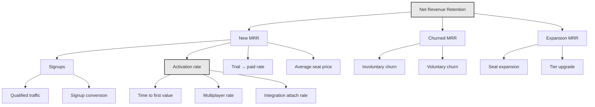

# Worked Example — Taxonomy for a PLG SaaS

A complete taxonomy, designed end to end, for a fictional company. Every principle in this repository applied to one concrete case.

> **Arclight** is invented. Any resemblance to a real product is coincidental. The numbers are illustrative and internally consistent, not drawn from any client.

---

## 1. Context

| | |
|---|---|
| **Product** | Arclight — collaborative pipeline management for B2B revenue teams |
| **Motion** | Product-led, with a sales-assisted enterprise tier |
| **ICP** | 20–200 employee B2B companies with a revenue team of 3–25 |
| **Pricing** | Free (3 seats) · Starter €19/seat · Growth €49/seat · Enterprise custom |
| **Trial** | 14 days on Growth, no card required |
| **Surfaces** | Marketing site, web app, iOS app, public API, Slack and CRM integrations |
| **Stack** | GTM web + server container · GA4 · BigQuery · Postgres · Stripe · HubSpot |

---

## 2. The metrics tree

Start at the number the board cares about and decompose until you hit something instrumentable. Events fall out of the bottom of this diagram; they are not chosen first.



**Activation is highlighted because it is the only node that influences three others** — trial conversion, expansion, and churn — which makes it the highest-leverage thing to instrument well.

---

## 3. The activation definition

> **Arclight activation, v2026.2**
>
> An **account** is activated when, within **14 days** of `account_created`, it has:
>
> 1. ≥ 1 `pipeline_created`
> 2. ≥ 3 `member_added` (≥ 2 distinct human members beyond the creator)
> 3. ≥ 20 `deal_created` across ≥ 2 distinct days
> 4. ≥ 1 `integration_connected` with `integration_category = 'crm'`
>
> **Derivation.** Cohort analysis of 4,180 accounts created 2025-07 → 2025-12. Accounts meeting all four criteria retained at **68%** at week 12; accounts meeting two or fewer retained at **19%**. Criterion 4 was added in v2026.2 after CRM-connected accounts showed a 22-point retention gap over non-connected accounts at matched usage levels.
>
> **Superseded** v2026.1 (which omitted criterion 4) on 2026-03-01. Historical comparisons across the boundary require the `activation_definition_version` property.

That last paragraph is the difference between a metric and a number someone made up. It states what changed, when, and why — which is the only way a trend line stays interpretable across a definition change.

---

## 4. Event inventory

**38 events.** Every one traceable to a node in the metrics tree.

### Tier 0 — reconciles with money or contracts (11)

| Event | Source | Owner | Key properties |
|---|---|---|---|
| `signup_completed` | server | growth-eng | `signup_method`, `is_new_account`, `email_domain_type` |
| `account_created` | server | growth-eng | `creation_path`, `plan_tier`, `is_trial`, `trial_ends_at` |
| `trial_started` | server | growth | `trial_length_days`, `requires_payment_method`, `trial_source` |
| `trial_expired` | server | growth | `converted`, `activation_reached`, `days_active_in_trial` |
| `subscription_started` | server | rev-eng | `mrr`, `currency`, `seat_count`, `converted_from_trial`, `sales_assisted` |
| `subscription_upgraded` | server | rev-eng | `mrr_delta`, `plan_tier_previous`, `change_trigger` |
| `subscription_downgraded` | server | rev-eng | `mrr_delta`, `seat_count_previous`, `change_trigger` |
| `subscription_cancelled` | server | rev-eng | `cancellation_reason`, `mrr_lost`, `effective_at` |
| `subscription_expired` | server | rev-eng | `mrr_lost`, `subscription_age_days` |
| `payment_failed` | server | rev-eng | `failure_reason`, `retry_number`, `is_terminal` |
| `activation_reached` | server | head-of-growth | `activation_definition_version`, `time_to_activation_h`, `criteria_met` |

### Tier 1 — activation and retention loop (13)

| Event | Source | Owner | Key properties |
|---|---|---|---|
| `user_identified` | server | data-eng | `anonymous_id`, `binding_trigger` |
| `pipeline_created` | server | pm-core | `creation_method`, `template_id`, `pipeline_index`, `stage_count` |
| `deal_created` | server | pm-core | `creation_method`, `deal_value_band`, `pipeline_id`, `is_first_of_day` |
| `deal_stage_changed` | server | pm-core | `stage_from`, `stage_to`, `days_in_previous_stage`, `is_forward` |
| `deal_closed` | server | pm-core | `close_outcome`, `deal_value_band`, `cycle_length_days` |
| `member_added` | server | pm-core | `member_role`, `change_source`, `seat_count_after` |
| `invite_sent` | server | growth | `invite_count`, `invite_role`, `invite_surface`, `recipient_domain_matches_account` |
| `invite_accepted` | server | growth | `invite_id`, `hours_to_accept`, `is_new_user` |
| `integration_connected` | server | platform | `integration_slug`, `integration_category`, `connection_index` |
| `integration_sync_failed` | server | platform | `failure_reason`, `consecutive_failure_count`, `is_user_actionable` |
| `onboarding_step_completed` | both | growth-pm | `flow_id`, `flow_version`, `step_id`, `step_outcome` |
| `feature_gate_blocked` | both | growth | `gate_id`, `required_plan_tier`, `upgrade_prompt_shown` |
| `lead_captured` | server | marketing-ops | `form_type`, `email_domain_type`, `is_marketing_qualified` |

### Tier 2 — feature usage and diagnostics (12)

`page_view` · `content_engaged` · `cta_clicked` · `form_started` · `form_abandoned` · `login_completed` · `login_failed` · `feature_used` · `feature_configured` · `export_completed` · `search_performed` · `api_error_returned`

### Tier 3 — experimental, expires 2026-12-15 (2)

`ai_summary_requested` · `ai_summary_accepted`

---

## 5. The name-explosion problem, solved

Arclight's original plan had 147 events. Most of the reduction came from four consolidations.

| Original | Count | Consolidated to | Properties absorbing the variation |
|---|---|---|---|
| `deal_moved_to_qualified`, `..._to_proposal`, `..._to_negotiation`, `..._to_closed` × 7 stages | 7 | `deal_stage_changed` | `stage_from`, `stage_to` |
| `export_csv_clicked`, `export_pdf_clicked`, `export_xlsx_clicked` × 4 surfaces | 12 | `export_completed` | `export_format`, `export_surface` |
| `slack_connected`, `hubspot_connected`, `salesforce_connected`, … | 19 | `integration_connected` | `integration_slug`, `integration_category` |
| `onboarding_step_1_done` … `onboarding_step_6_done`, × 3 flows | 18 | `onboarding_step_completed` | `flow_id`, `step_id`, `step_index`, `step_outcome` |
| **Total** | **56** | **4** | |

Fifty-six names collapsed into four. Nothing was lost: every original question is still answerable, with one query instead of seven and one dashboard tile instead of twelve.

**And the crucial property:** adding an eighth pipeline stage, a fifth export format, or a twentieth integration now requires **zero** changes to the taxonomy, the container, or the warehouse schema.

---

## 6. GA4 dimension budget

50 event-scoped slots available. Budget capped at 30 to leave headroom.

| # | Dimension | Cardinality | Scope |
|---|---|---|---|
| 1 | `plan_tier` | 4 | user |
| 2 | `account_id` | unbounded | user — **warehouse only, not registered** |
| 3 | `company_size_band` | 6 | user |
| 4 | `is_internal` | 2 | user |
| 5 | `account_health_band` | 4 | user |
| 6 | `page_type` | 11 | event |
| 7 | `content_group` | ~15 | event |
| 8 | `signup_method` | 6 | event |
| 9 | `creation_method` | 6 | event |
| 10 | `integration_slug` | ~20 | event |
| 11 | `integration_category` | 6 | event |
| 12 | `stage_from` | 8 | event |
| 13 | `stage_to` | 8 | event |
| 14 | `deal_value_band` | 5 | event |
| 15 | `close_outcome` | 3 | event |
| 16 | `flow_id` | 5 | event |
| 17 | `flow_version` | ~6 | event |
| 18 | `step_id` | ~12 | event |
| 19 | `step_outcome` | 3 | event |
| 20 | `export_format` | 5 | event |
| 21 | `export_surface` | 5 | event |
| 22 | `gate_id` | ~12 | event |
| 23 | `required_plan_tier` | 4 | event |
| 24 | `cancellation_reason` | 7 | event |
| 25 | `failure_reason` | 7 | event |
| 26 | `form_type` | 7 | event |
| 27 | `email_domain_type` | 4 | event |
| 28 | `cta_location` | 7 | event |
| 29 | `feature_id` | ~30 | event |
| 30 | `usage_depth` | 4 | event |

**Consumption: 25 event-scoped of 50, 4 user-scoped of 25.** Room to grow, and every registered dimension is bounded.

The machine-readable version of this plan is [`../tooling/tracking-plan.json`](../tooling/tracking-plan.json) — every Tier 0 and Tier 1 event in full, plus representative Tier 2 and Tier 3 entries, each with owner, trigger, decision, monitoring rule, reconciliation source and property types. It is validated in CI by [`../tooling/validate.mjs`](../tooling/validate.mjs).

**`account_id` is deliberately not registered.** It is unbounded, it would trigger `(other)` aggregation within weeks, and it is a join key rather than a dimension. It lives in BigQuery, where cardinality costs nothing.

---

## 7. Sample data layer pushes

### Activation reached — server-emitted

```json
{
  "event": "activation_reached",
  "event_id": "7d3e91b2-4c85-4f61-a209-3b7e5c1d8a04",
  "event_ts": "2026-09-09T08:41:02.117Z",
  "source": { "emitter": "worker", "emitter_version": "2026.9.3", "is_backfill": false },
  "identity": { "account_id": "acc_8f21c4", "user_id": "u_3a7d90", "actor_type": "system" },
  "properties": {
    "activation_definition_version": "2026.2",
    "time_to_activation_h": 91,
    "criteria_met": "pipeline_created,member_added,deal_created,crm_connected",
    "activation_path": "guided",
    "is_account_first_activation": true
  },
  "governance": {
    "tier": 0, "contains_pii": false, "retention_days": 1460,
    "lawful_basis": "contract",
    "destinations": ["ga4", "warehouse", "crm", "product_analytics"]
  }
}
```

### Feature gate blocked — the expansion signal

```json
{
  "event": "feature_gate_blocked",
  "event_id": "1a9c5f70-8e42-4b3d-91c6-2f4a8d7e0b13",
  "event_ts": "2026-09-09T13:22:47.309Z",
  "context": {
    "anonymous_id": "c4e7a018-9b2d-4f31-8a56-7d0c3e9f1b28",
    "session_id": "s_01J9AB3C7D",
    "app_surface": "web",
    "app_version": "2026.9.3",
    "environment": "production",
    "page": { "page_path": "/app/pipelines/{pipeline_id}/automations", "page_type": "app", "is_authenticated": true },
    "consent": {
      "ad_storage": "denied", "analytics_storage": "granted",
      "ad_user_data": "denied", "ad_personalization": "denied",
      "cmp_version": "4.2.1", "region_rule": "eea_strict"
    }
  },
  "user": { "user_id": "u_3a7d90", "user_role": "admin", "is_internal": false },
  "account": { "account_id": "acc_8f21c4", "plan_tier": "starter", "seat_count": 6, "is_trial": false },
  "properties": {
    "gate_id": "pipeline_automation",
    "required_plan_tier": "growth",
    "gate_surface": "automation_builder",
    "upgrade_prompt_shown": true
  }
}
```

Note `page_path` is templated. The populated path would carry a pipeline identifier and produce a dimension with unbounded cardinality.

---

## 8. Queries this taxonomy makes possible

### Activation funnel, held constant on definition version

```sql
WITH cohort AS (
  SELECT account_id, MIN(event_ts) AS created_at
  FROM events WHERE event_name = 'account_created'
    AND DATE(event_ts) BETWEEN '2026-07-01' AND '2026-07-31'
  GROUP BY account_id
),
criteria AS (
  SELECT c.account_id,
    MAX(e.event_name = 'pipeline_created')                                     AS has_pipeline,
    COUNTIF(e.event_name = 'member_added')                                     AS members,
    COUNT(DISTINCT IF(e.event_name = 'deal_created', DATE(e.event_ts), NULL))  AS deal_days,
    MAX(e.event_name = 'integration_connected'
        AND e.integration_category = 'crm')                                    AS has_crm
  FROM cohort c
  JOIN events e USING (account_id)
  WHERE e.event_ts BETWEEN c.created_at AND TIMESTAMP_ADD(c.created_at, INTERVAL 14 DAY)
  GROUP BY c.account_id
)
SELECT
  COUNT(*)                                                          AS accounts,
  COUNTIF(has_pipeline)                                             AS c1_pipeline,
  COUNTIF(has_pipeline AND members >= 3)                            AS c2_members,
  COUNTIF(has_pipeline AND members >= 3 AND deal_days >= 2)         AS c3_deals,
  COUNTIF(has_pipeline AND members >= 3 AND deal_days >= 2
          AND has_crm)                                              AS c4_activated
FROM criteria;
```

### Expansion signals, ranked by intent

```sql
SELECT account_id, plan_tier,
       COUNTIF(event_name = 'feature_gate_blocked')                    AS gate_hits,
       COUNT(DISTINCT IF(event_name = 'feature_gate_blocked',
                         gate_id, NULL))                               AS distinct_gates,
       MAX(required_plan_tier)                                         AS tier_needed
FROM events
WHERE event_ts >= TIMESTAMP_SUB(CURRENT_TIMESTAMP(), INTERVAL 28 DAY)
  AND plan_tier != 'enterprise'
GROUP BY account_id, plan_tier
HAVING gate_hits >= 5 AND distinct_gates >= 2
ORDER BY gate_hits DESC;
```

Five blocks across two distinct gates in 28 days is a live upgrade conversation. This query is a sales queue, not a report — and it exists because `feature_gate_blocked` was designed as a Tier 1 event rather than an afterthought.

### Onboarding leak, comparison-safe

```sql
SELECT flow_version, step_index, step_id,
       COUNTIF(step_outcome = 'completed') AS completed,
       COUNTIF(step_outcome = 'skipped')   AS skipped,
       COUNTIF(step_outcome = 'failed')    AS failed,
       ROUND(COUNTIF(step_outcome = 'completed') /
             NULLIF(COUNT(*), 0) * 100, 1) AS completion_pct
FROM events
WHERE event_name = 'onboarding_step_completed'
  AND flow_id = 'initial_setup'
  AND DATE(event_ts) >= '2026-06-01'
GROUP BY flow_version, step_index, step_id
ORDER BY flow_version, step_index;
```

`flow_version` is in the GROUP BY, not filtered out. Two versions of the flow produce two comparable series rather than one misleading average.

---

## 9. What was rejected, and why

| Proposal | Verdict | Reason |
|---|---|---|
| `dashboard_viewed` | Rejected | Already `page_view` with `page_type: app`. Duplication test |
| `deal_value_entered` | Rejected | Field-level tracking. `deal_created` carries `deal_value_band` |
| `pricing_page_viewed` | Rejected | `page_view` with `page_type: pricing`. Duplication test |
| `user_scrolled_50` | Rejected | Four scroll events per pageview, no decision attached |
| `search_query_submitted` with the query string | **Rejected** | Free text is an uncontrolled PII channel. Kept `search_performed` without the query |
| `email_opened` as a lifecycle trigger | Rejected as a trigger | Unreliable since Apple MPP. Kept as a Tier 2 diagnostic only |
| `deal_value` as an exact figure in GA4 | Rejected | Commercially sensitive and unbounded. Banded to `deal_value_band` |
| `onboarding_tooltip_shown` | Rejected | Measures the UI, not the user's progress |
| `ai_summary_requested` | **Accepted as Tier 3** | Genuinely novel. 90-day expiry attached, expires 2026-12-15 |

Nine proposals, seven rejected. **That ratio is what an architect is for.** The rejections cost nothing and saved a plan that would otherwise be at 60 events with the same analytical power.

---

**See also:** [Example container structure](example-container-structure.md) · [How to think about events](../philosophy/how-to-think-about-events.md) · [Data minimalism](../philosophy/data-minimalism.md)
