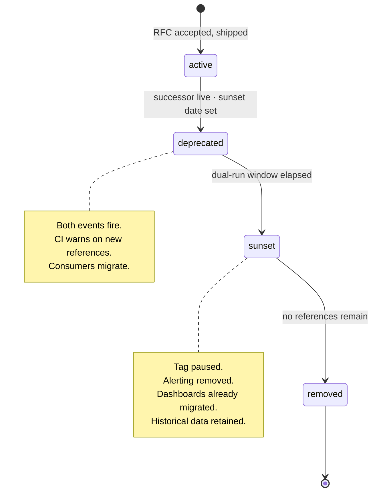

# Ownership & Versioning

The part that determines whether the architecture survives eighteen months without you.

Everything else in this repository describes how to build measurement correctly once. This describes how it stays correct.

---

## Ownership

### One event, one person

Not a team. Not a rota. A named individual, recorded in `tracking-plan.json`, enforced by CI.

An owner is accountable for four things:

1. **Definition.** They can state what the event means and defend the boundary cases.
2. **Health.** They are alerted when it breaks and they respond.
3. **Change.** Nothing about the event changes without their sign-off.
4. **Retirement.** They decide, at review, whether it still earns its place.

"Growth owns it" means nobody owns it. Ownerless events are the ones that stop firing on a Friday and are noticed the following month.

### Ownership by tier

| Tier | Owner is typically | Escalation |
|---|---|---|
| 0 | A named engineer on the team that emits it | Head of Data |
| 1 | The PM for the surface it measures | Head of Product |
| 2 | The feature owner | The feature's PM |
| 3 | Whoever requested it | Auto-deleted at expiry if unclaimed |

### Handover

Ownership transfers explicitly, in a PR, or it has not transferred.

```
- "owner": "priya@example.com"
+ "owner": "tomas@example.com"
```

When someone leaves, their events appear in one search. Reassign or deprecate them in the same week — an unowned Tier 0 event is an incident waiting for a quiet weekend.

### The architect's role

The architect owns the **system**, not the events: conventions, budgets, the validator, the gates, and the right to say no in Gate 1.

That last one is the job. An architect who approves every request is a ticket queue with a title.

---

## Versioning

Three things version independently, on different cadences, for different reasons.

| What | Versioned as | Changes when |
|---|---|---|
| **The plan** | `YYYY.N.P` — `2026.2.0` | Any change to events, properties, or conventions |
| **A definition** | `YYYY.N` — `2026.2` | The business meaning of a derived metric changes |
| **A flow** | `YYYY.N` — `2026.3` | An onboarding flow's structure changes |

### Plan versioning

```
2026.2.0
│    │ │
│    │ └── patch — documentation, non-semantic clarification
│    └──── minor — additive: new events, new optional properties, new enum members
└───────── year.cycle — breaking: renames, removals, type changes, required-property additions
```

**Minor is additive and safe.** Anything a consumer could be relying on staying the same is a breaking change, and breaking changes go through the deprecation lifecycle below.

### Definition versioning

The most-quoted numbers in a company — activation, adoption, qualified lead, churn — are derived definitions, and they change. Versioning them is what keeps a trend line interpretable across the change.

```jsonc
{
  "activation": {
    "current_version": "2026.2",
    "versions": [
      { "version": "2026.2", "effective_from": "2026-03-01", "criteria": [ /* … */ ],
        "derivation": "Cohort analysis of 4180 accounts. Accounts meeting all four criteria retained at 68% at week 12 vs 19% for two or fewer." },
      { "version": "2026.1", "effective_from": "2026-01-01", "superseded_on": "2026-03-01", "criteria": [ /* … */ ],
        "derivation": "Superseded: CRM-connected accounts showed a 22-point retention gap at matched usage levels." }
    ]
  }
}
```

Three rules make this work:

1. **The version travels on the event.** `activation_reached` carries `activation_definition_version`. Without it, every historical comparison silently mixes definitions.
2. **The derivation is recorded.** Not just what the threshold is — the evidence it came from. That sentence is what separates a metric from a number someone made up in a planning meeting.
3. **Never recompute history silently.** If you restate historical activation under a new definition, say so on the chart. A metric that changes retroactively without a note destroys more trust than a metric that was wrong.

---

## The deprecation lifecycle

Nothing goes from `active` to `removed`. Nothing sits in `deprecated` without a date.



| Stage | What is true | Duration |
|---|---|---|
| `active` | Normal operation, monitored per tier | — |
| `deprecated` | Successor is live. Both fire. CI warns on new references. `@deprecated` appears in generated types, so every call site surfaces in editors | Tier 0: 90 days · Tier 1: 90 · Tier 2: 60 · Tier 3: 0 |
| `sunset` | Tag paused, alerting removed, dashboards migrated. Historical data intact | 30 days |
| `removed` | Deleted from the plan. Historical data retained per the retention policy | — |

**The dual-run window is not padding.** It is the only period in which you can verify the successor matches the original before you lose the ability to compare.

---

## Change classification

| Change | Breaking | Process |
|---|---|---|
| New event | No | RFC → PR → Gates |
| New optional property | No | PR review |
| New required property | **Yes** | RFC + dual-run — old rows lack the field |
| New enum member | No, but | PR + **announce**: downstream filters may silently exclude it |
| Removing an enum member | **Yes** | Deprecate. Historical values must keep their meaning forever |
| Removing a property | **Yes** | Deprecate → 60-day sunset → remove |
| Changing a property's type | **Yes** | New property name. Never mutate a type in place |
| Renaming an event | **Yes** | New name + dual-run + migration. Never a rename in place |
| Changing what an event counts | **Yes** | New name. This is the same as a rename, and pretending otherwise is R-14 |
| Changing a trigger condition | **Yes** if semantics change | RFC — this is the most-missed breaking change there is |
| Adding a destination | No | PR + a privacy check on the new destination |
| Changing a tier | Depends | Upward: adopt the higher tier's obligations first. Downward: RFC |
| Changing a definition | **Yes** | New definition version + annotation on every affected chart |

**The row people get wrong is "changing a trigger condition".** Moving `signup_completed` from form submit to transaction commit is technically more correct and semantically a different event. It steps the metric, and if the name did not change, nobody can tell whether the market moved or the code did.

---

## Review cadence

| Cadence | Review | Output |
|---|---|---|
| **Weekly** | Open RFCs, failing monitors, deprecated events past sunset | Decisions, unblocked work |
| **Monthly** | Tier 0 reconciliation against the source of record | Variance report; > tolerance is an incident |
| **Quarterly** | Container health metrics, folder `99`, access review | Cleanup PRs |
| **Annually** | Full plan review: every Tier 0–2 event justified or deprecated | A plan that is smaller than last year's, or a reason why not |

### The annual review question

For every event: **"Show me the decision this changed in the last twelve months."**

- Named decision → keep.
- Query volume but no decision → keep, mark for next year.
- Neither → deprecate.

Tracking plans do not shrink on their own. This is the only mechanism that shrinks them.

---

## Access

| Right | Who | Review |
|---|---|---|
| GTM Publish | ≤ 4 named individuals | Every 6 months |
| GTM Edit | The measurement team + named engineers | Every 6 months |
| GTM Read | Anyone who asks | — |
| GA4 Administrator | ≤ 2 | Every 6 months |
| Plan merge rights | Data architect + one deputy | Annually |
| Server container | Platform engineering only | Every 6 months |

**Publish rights are the sharpest edge in the estate.** Everything else is reviewable after the fact; a publish is live in seconds, for everyone.

---

## What good looks like after twelve months

| Signal | Healthy |
|---|---|
| Events deleted this year | ≥ 5 |
| Events added this year | ≤ 15 |
| Events with an owner | 100% |
| Tier 0 reconciliation variance | < 0.5% every month |
| Mean time to detect a broken Tier 0 event | < 2 hours |
| RFCs rejected | ≥ 30% of submissions |
| Definitions with a recorded derivation | 100% |
| Plan/container drift | < 5% |

**The rejection rate matters more than it looks.** A team that accepts every proposal is not governing a plan; it is accumulating one. Thirty percent rejection means Gate 1 is doing its job — and every rejection is thirty minutes spent instead of a sprint.

---

**See also:** [Event RFC template](event-rfc-template.md) · [Data minimalism](../philosophy/data-minimalism.md) · [QA process](../gtm-templates/qa-process.md) · [Common risks](../audits/common-risks.md)
