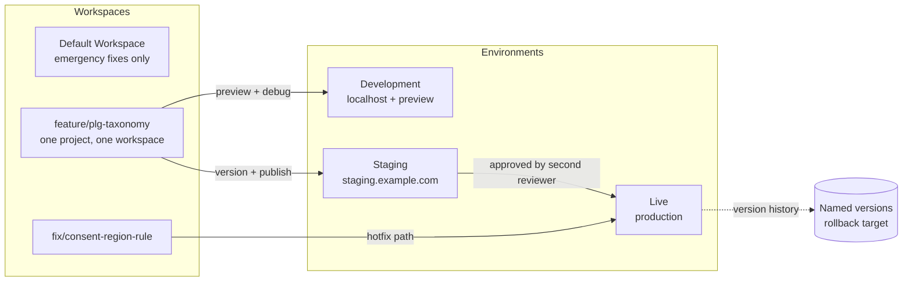

# Container Structure

A GTM container reaches 200 assets faster than anyone expects. Without structure imposed on day one, it becomes an archaeological site: nobody knows what fires, nobody dares delete anything, and every change is a small act of courage.

This is the structure. It is boring on purpose.

---

## Naming grammar

### Tags

```
<PLATFORM> <TYPE> — <descriptor> — <scope>
```

```
GA4 CFG — base configuration — All Pages
GA4 EV — workspace_created — dl event
GA4 EV — purchase — dl event
META CAPI — purchase — server
GADS CONV — trial_started — dl event
LI INSIGHT — base — All Pages
HTML — consent defaults — Consent Init
HTML — data layer sanitiser — All Pages
SGTM CLIENT — GA4 relay — server
```

| Segment | Rule |
|---|---|
| `PLATFORM` | Uppercase abbreviation: `GA4`, `GADS`, `META`, `LI`, `MS`, `HTML`, `SGTM` |
| `TYPE` | `CFG` config · `EV` event · `CONV` conversion · `CAPI` server API · `INSIGHT` base pixel · `HTML` custom |
| `descriptor` | **The canonical event name, verbatim.** Not a paraphrase, not a friendly label |
| `scope` | Trigger scope in three words or fewer |
| Separator | ` — ` (space, em dash, space). Unmistakable and searchable |

The `descriptor` rule matters more than it looks. When someone searches the container for `workspace_created`, they must find every asset that touches it — tag, trigger, and variable — in one search. Friendly labels break that.

### Triggers

```
<TYPE> — <descriptor> — <condition>
```

```
CE — workspace_created — dl event
CE — purchase — dl event + ecommerce exists
CLICK — cta — [data-analytics-id] exists
PV — all pages — production only
INIT — consent defaults — Consent Initialization
VIS — pricing table — 50% for 1s
HIST — spa route change — history change
EXC — internal traffic — is_internal true
```

| Prefix | Trigger type |
|---|---|
| `CE` | Custom Event |
| `PV` | Page View / DOM Ready / Window Loaded |
| `CLICK` | Click — All Elements / Just Links |
| `FORM` | Form Submission |
| `VIS` | Element Visibility |
| `HIST` | History Change |
| `TIME` | Timer |
| `SCROLL` | Scroll Depth |
| `INIT` | Initialization / Consent Initialization |
| `EXC` | Exception (blocking trigger) |

### Variables

```
<TYPE> — <descriptor>
```

```
DLV — event_id
DLV — properties.workspace_id
DLV — context.consent.analytics_storage
CJS — sanitised page location
LT — country to consent region
RT — internal ip ranges
CONST — ga4 measurement id
CONST — ga4 measurement id staging
```

| Prefix | Variable type |
|---|---|
| `DLV` | Data Layer Variable |
| `CJS` | Custom JavaScript |
| `LT` | Lookup Table |
| `RT` | RegEx Table |
| `CONST` | Constant |
| `COOKIE` | 1st-Party Cookie |
| `URL` | URL / Referrer |
| `DOM` | DOM Element (avoid; see §Anti-patterns) |
| `AUTO` | Auto-Event Variable |

---

## Folder structure

Folders are the only navigational tool GTM gives you. Use all of them.

```
00 — Core Infrastructure
     Consent defaults, GA4 config, sanitiser, base pixels,
     initialisation. Everything that must fire before anything else.

01 — Consent & Privacy
     CMP integration, consent state listener, consent-driven
     blocking triggers, region lookup tables.

10 — Product Events
     Tier 0/1 in-product events: subscription, account, workspace.

11 — Marketing Events
     Forms, CTAs, content engagement, page classification.

12 — Onboarding & Activation
     The onboarding_* family and activation signals.

13 — Ecommerce
     The GA4 ecommerce funnel, end to end.

20 — Advertising Platforms
     Google Ads, Meta, LinkedIn, Microsoft. Conversion tags only —
     base pixels live in 00.

30 — Server-Side Bridge
     Tags emitting to the server container, transport config.

90 — Diagnostics
     Debug tags, console loggers, validation. NEVER active in production.

99 — Deprecated
     Paused, awaiting deletion. Every asset here carries a
     removal date in its notes field.
```

**Numeric prefixes** because GTM sorts folders alphabetically and `00` before `01` before `10` is the firing order made visible.

**Folder 99 is a queue, not a graveyard.** Anything sitting there without a removal date is a governance failure. Review it monthly.

**Every asset lives in exactly one folder.** An unfoldered asset in a mature container is invisible: it never appears when someone browses by area and it is found only by accident.

---

## Workspace and environment model



**Rules that keep this working:**

1. **One workspace per project.** Never two people in the same workspace: GTM's conflict resolution is manual, and it will eat a change.
2. **Workspace names mirror the git branch.** `feature/plg-taxonomy` in git, `feature/plg-taxonomy` in GTM. The connection is otherwise lost.
3. **Never publish from Default.** It is the shared workspace and it accumulates other people's half-finished work.
4. **Every version gets a name and a description.** `2026-09-09 — PLG taxonomy v2 — adds 6 onboarding events, deprecates 3` is a rollback target. `Version 47` is not.
5. **Environments carry different measurement IDs**, resolved through a lookup table on hostname — never a hardcoded constant.
6. **Delete the workspace after publishing.** Stale workspaces silently diverge from live and re-apply old changes when someone finally publishes them.

### Environment resolution

```
LT — environment by hostname
  localhost, *.local            → development
  staging.example.com           → staging
  example.com, app.example.com  → production
  default                       → development

LT — ga4 measurement id by environment
  development  → G-DEVXXXXXXX
  staging      → G-STGXXXXXXX
  production   → G-PRDXXXXXXX
```

A hardcoded production ID is how staging traffic ends up in the production property, and it is unfixable retroactively.

---

## Firing order

GTM guarantees order only through tag sequencing and priorities. Both, explicitly.

| Priority | Assets | Trigger |
|---|---|---|
| `1000` | Consent defaults | Consent Initialization |
| `900` | Data layer sanitiser, environment resolution | Initialization |
| `800` | GA4 configuration tag | Initialization |
| `700` | Base advertising pixels | All Pages |
| `500` | Page-scoped event tags | Page View / DOM Ready |
| `100` | Custom event tags | Custom Event |
| `0` | Diagnostics | Debug only |

**Consent defaults at priority 1000 on the Consent Initialization trigger is non-negotiable.** Anything that evaluates before consent state exists is either a compliance finding or a lost event, and usually both.

---

## Consent configuration

Every tag declares its own consent requirements. Nothing inherits, nothing is assumed.

| Tag | Requires | Behaviour when denied |
|---|---|---|
| GA4 CFG — base configuration | `analytics_storage` | Cookieless ping (Consent Mode) |
| GA4 EV — * | `analytics_storage` | Cookieless ping |
| GADS CONV — * | `ad_storage`, `ad_user_data` | Not sent; modelled by the platform |
| META CAPI — * | `ad_storage`, `ad_user_data`, `ad_personalization` | Not sent |
| LI INSIGHT — base | `ad_storage` | Not sent |
| HTML — consent defaults | None | Always fires — it *is* the consent layer |
| HTML — data layer sanitiser | None | Always fires — it is a safety control |

**Additional consent checks** are set per tag in GTM's built-in consent settings. Never build your own consent gate as a trigger condition — a `blockingTrigger` on a consent variable races the CMP and fails in exactly the cases you care about.

---

## Server-side container

When there is one, the division of responsibility is fixed:

| Concern | Web container | Server container |
|---|---|---|
| Consent capture | ✓ | Reads the forwarded state |
| DOM interaction | ✓ | — |
| Client-side enrichment | Minimal | Primary |
| PII handling | **Never** | Hashing and match keys |
| Advertising conversion APIs | — | ✓ |
| Data enrichment from internal systems | — | ✓ |
| First-party cookie writing | Fallback | Primary (survives ITP) |
| Tier 0 revenue events | Never authoritative | ✓ |

Naming carries the prefix `SGTM`:

```
SGTM CLIENT — GA4 relay
SGTM TAG — GA4 → BigQuery
SGTM TAG — META CAPI — purchase
SGTM VAR — hashed email from request body
SGTM TRANSFORM — strip pii from all events
```

`SGTM TRANSFORM — strip pii from all events` is a defence-in-depth control: a global transformation that removes any field matching a PII pattern before it reaches any downstream tag, regardless of what the client sent. Everything else can fail; this must not.

---

## Documentation inside the container

Every tag's **notes** field carries four lines. Thirty seconds per tag, and it is the difference between a container someone can inherit and one they have to reverse-engineer.

```
Purpose:  Sends workspace_created to GA4. Tier 1 activation event.
Owner:    pm.growth@example.com
Spec:     github.com/<org>/gtm-architecture/event-taxonomy/product-events.md#workspace_created
Changed:  2026-09-09 — added template_id parameter (PR #418)
```

---

## Anti-patterns

| Anti-pattern | What it costs |
|---|---|
| CSS-selector click triggers | Silent breakage on every redesign, discovered weeks later |
| `DOM` variables scraping page text | Same, plus PII exposure when the scraped node contains user content |
| Custom HTML tags doing real work | Unversioned, untestable, invisible logic. Push it to the app |
| Hardcoded measurement IDs | Staging data in production properties, permanently |
| One tag per page for the same event | Twelve tags where one tag with a variable belongs |
| Publishing from Default workspace | Ships someone else's unfinished work |
| No folders | A 200-asset container nobody can navigate |
| Blocking triggers as a consent gate | Races the CMP; fails exactly when it matters |
| Debug tags live in production | Console noise, performance cost, and occasionally a data leak |
| Unnamed versions | No rollback target when something breaks at 17:00 on a Friday |
| `Lookup Table` used as business logic | Business rules belong in the application, not in a measurement tool |

---

## Container health metrics

Run these quarterly. Every one of them is a question you can answer in ten minutes.

| Metric | Healthy | Investigate |
|---|---|---|
| Total tags | < 80 | > 150 |
| Tags fired in the last 30 days | > 90% | < 75% |
| Custom HTML tags | < 5 | > 15 |
| Unfoldered assets | 0 | > 5 |
| Assets in `99 — Deprecated` without a removal date | 0 | ≥ 1 |
| Tags without a consent declaration | 0 | ≥ 1 |
| Tags without notes | < 10% | > 30% |
| Open workspaces older than 30 days | 0 | ≥ 2 |
| Container size | < 500 KB | > 800 KB (GTM's hard cap is 1 MB) |

---

**See also:** [Tag flow diagrams](tag-flow-diagram.md) · [QA process](qa-process.md) · [Audit checklist](audit-checklist.md) · [Example container structure](../examples/example-container-structure.md)
