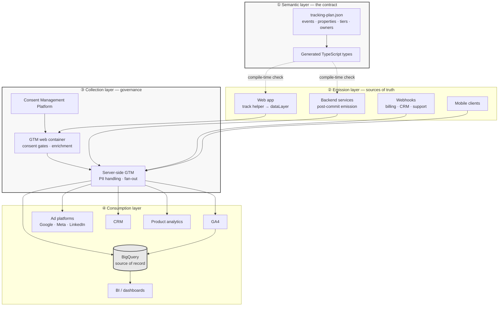
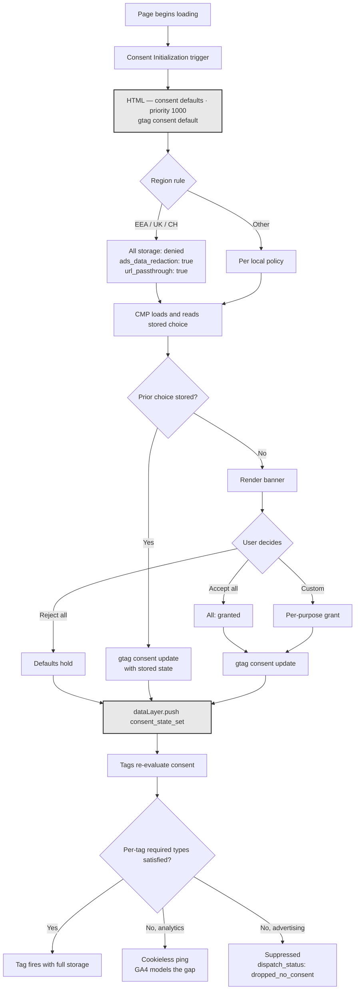
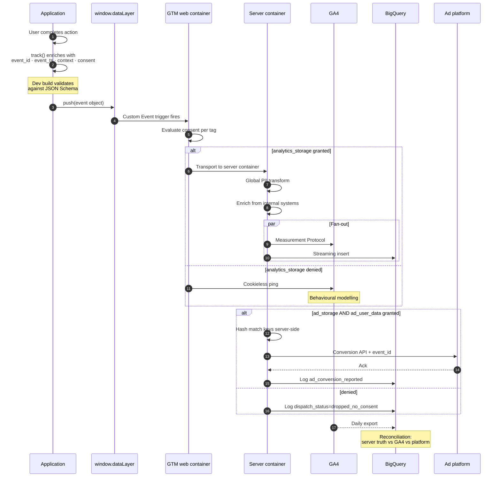
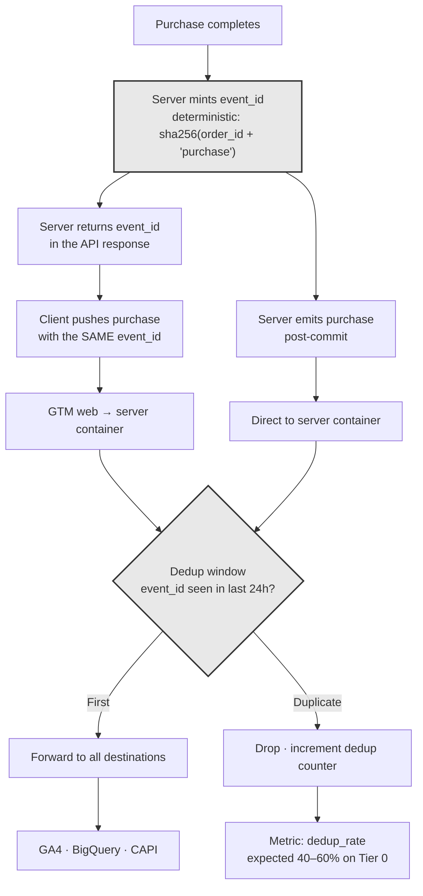
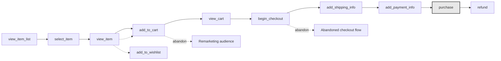
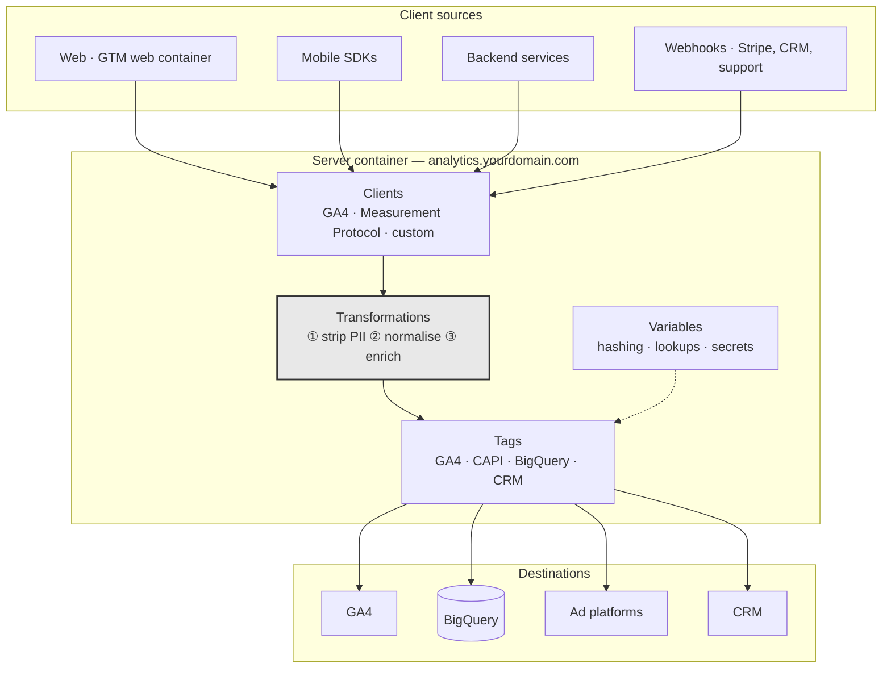
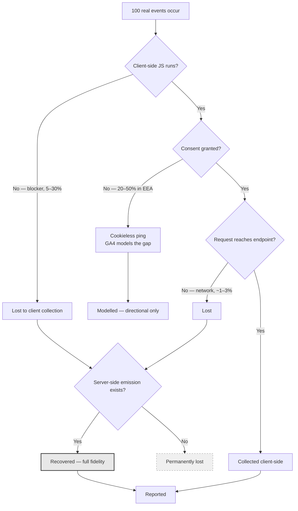

# Tag Flow Diagrams

Reference architecture, drawn. Every diagram here is implementable as-is and maps directly to the naming in [`container-structure.md`](container-structure.md).

---

## 1. End-to-end architecture

The four layers. Most estates fail because they conflate two of them.

**The dotted lines are the point.** The plan is not documentation *about* the implementation; it *generates* the types the implementation is checked against. That is what makes the contract enforceable rather than aspirational.

---

## 2. Consent gate

The order here is not a preference. It is the difference between a compliant implementation and a finding.

**Three failure modes this design eliminates:**

- **Defaults set too late.** Anything evaluating before the default is a cookie written without a basis. Priority 1000 on Consent Initialization is the only correct placement.
- **Denied ≠ silent.** `analytics_storage: denied` sends cookieless pings that feed GA4's modelling. Blocking the tag entirely throws that away.
- **Consent state unmeasured.** `consent_state_set` plus per-event `consent_*` snapshots mean a consent shift is visible as a consent shift, not as a mysterious 18% traffic drop.

---

## 3. Event lifecycle — from push to destinations

**Step 2 is where most implementations go wrong.** Enrichment happens in one helper, once. Enriching inside GTM means the server pipeline and the client pipeline disagree about what an event contains, and nobody notices until reconciliation.

**The final note is the discipline that keeps everyone honest.** Three systems will report three numbers. Reconciling them monthly turns "the platforms disagree" from an argument into a diagnosis.

---

## 4. Client/server deduplication

Tier 0 events fire from both sides on purpose: the client for real-time UX, the server for truth. Deduplication is what stops that from doubling your revenue.

**A deterministic `event_id` is what makes this work under replay.** `sha256(order_id + event_name)` is stable across a retried webhook, a page refresh, and a backfill. A random UUID minted independently on each side deduplicates nothing.

**Watch `dedup_rate` as a health metric.** On a Tier 0 event with dual emission it should sit near 50%. A sudden drop to 5% means the client stopped firing — before any dashboard shows a change in totals, because the server side is still covering.

---

## 5. Ecommerce funnel

Every solid transition requires `ecommerce: null, _clear: true` on the push immediately before it. Every one. The dataLayer merges, and a stale `items` array attributed to the next event is the single most common cause of inflated ecommerce revenue.

---

## 6. Server-side tagging topology

**Three things this topology buys you that a web-only container cannot:**

1. **A same-site first-party endpoint.** Cookies set from `analytics.yourdomain.com` survive Safari ITP's 7-day cap on JS-set cookies. A subdomain of your own domain, not a vendor's.
2. **PII never touches the browser.** Hashing for Enhanced Conversions and CAPI happens where the raw value already legitimately lives.
3. **One emission, many destinations.** Adding a platform is a tag in the server container, not a script on every page and another 40 KB of client payload.

Transformation ① runs first and unconditionally. It is the control that holds when everything upstream fails.

---

## 7. Degradation model

What actually reaches your reports, and what each mitigation recovers.

**The architectural conclusion is one sentence:** Tier 0 events are emitted server-side, because that is the only branch that ends at "full fidelity".

**The reporting conclusion is the other sentence:** report the collection rate alongside the metric. "Signups down 12%" and "measured signups down 12% while consent grant fell 9 points" are different findings, and only one of them is true.

---

## 8. Change deployment flow

```mermaid
flowchart LR
    A["Event RFC<br/>governance/event-rfc-template.md"] --> B["PR to tracking-plan.json"]
    B --> C{"CI validation"}
    C -->|Fail| B
    C -->|Pass| D["Spec review<br/>owner + architect"]
    D --> E["Implementation<br/>app code + GTM workspace"]
    E --> F["Preview mode<br/>+ GA4 DebugView"]
    F --> G{"QA gate 2<br/>see qa-process.md"}
    G -->|Fail| E
    G -->|Pass| H["Version + name<br/>publish to staging"]
    H --> I["Staging soak · 24h"]
    I --> J{"QA gate 3<br/>pre-publish diff"}
    J -->|Fail| E
    J -->|Pass| K["Publish to live"]
    K --> L["Gate 4 · 24h live confirmation"]
    L -->|Anomaly| M["Roll back to named version"]
    L -->|Clean| N["Close · update CHANGELOG"]

    style C fill:#e8e8e8,stroke:#333,stroke-width:2px
    style M fill:#f0f0f0,stroke:#999,stroke-dasharray: 4 4
```

Rollback is a named version, restored in under a minute. That is the entire reason every version gets a description — it is the only thing that makes the rollback decision fast enough to be useful.

---

**See also:** [Container structure](container-structure.md) · [QA process](qa-process.md) · [Marketing events — consent](../event-taxonomy/marketing-events.md#4-consent)
