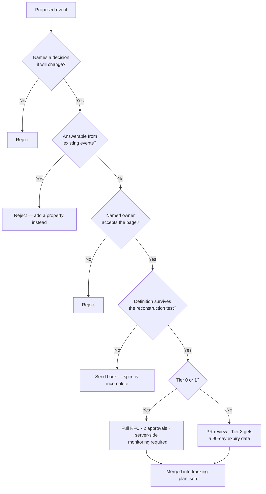

# Data Minimalism

> A tracking plan is a liability register, not an asset register.

Every event you collect has a cost that does not appear on any dashboard. Most teams only ever price the collection. This is the argument for pricing the rest.

---

## The four costs of an event

**1. Marginal collection cost — small, visible, and the only one anyone budgets for.**
Warehouse rows, streaming ingest, GA4 quota, CDP MTU tiers. Real, but rarely the constraint.

**2. Cognitive cost — large, invisible, compounding.**
Every event in the schema browser is a thing an analyst must read and dismiss. A 400-event plan where 40 matter means every new hire spends their first month learning which 360 to ignore, and every query risks picking the wrong one. This is where the real money goes.

**3. Governance cost — linear in event count, paid forever.**
Each event needs an owner, a definition, a monitoring rule, a consent classification, a retention policy, and a place in the deletion pipeline when a user exercises Article 17. Multiply by 400.

**4. Legal and trust cost — small probability, large magnitude.**
Under GDPR, data you collect without a purpose is data you cannot justify. "We might need it later" is not a lawful basis; it is the exact thing purpose limitation (Art. 5(1)(b)) and data minimisation (Art. 5(1)(c)) exist to prohibit. Every unnecessary field is surface area in a DPIA, a subject access request, and a breach.

**The asymmetry that matters:** the benefit of an event is realised in the first month. The costs are paid every month after.

---

## The distribution nobody wants to look at

Pull a 90-day query log against your event tables. In every organisation I have measured, the shape is the same:

```
Events by query volume, 90 days

Top 10 events        ████████████████████████████████████  ~80% of all queries
Next 30 events       ███████                               ~17%
Next 80 events       █                                     ~3%
Remaining 200+       ·                                      0 queries, ever
```

The tail is not free optionality. It is the reason your analysts are slow.

**Do this before you design anything new.** If you cannot run that query, that is itself the finding.

---

## The intake filter

Every proposed event passes all four gates or it does not enter the plan.



Gate 2 is where most of the value is. The reflex answer to a new question should be *"which property is missing from an event I already have?"* — not *"which event is missing?"*

---

## Property budgets

Caps force the conversation that otherwise never happens.

| Scope | Budget | Rationale |
|---|---|---|
| Properties per event | 8 soft, 12 hard | Beyond 12 you are logging a database row |
| Custom event-scoped dimensions registered in GA4 | 30 of 50 | Leave headroom; the ceiling is a hard platform limit |
| User-scoped dimensions in GA4 | 15 of 25 | Same, and user scope is the scarcer resource |
| Unbounded properties that are not `_id` join keys | 0 | Identifiers are legitimate joins. Anything else unbounded is free text in disguise |
| Free-text properties | 0 | Free text is a PII incident with a delay fuse |

Hitting a budget is not a failure. It is the system asking you which existing property is now less valuable than the one you want to add. Answer the question.

---

## Sunset policy

Events do not decay gracefully. They accumulate, and the accumulation is silent.

| Tier | Review cadence | Default action if unused | Sunset window |
|---|---|---|---|
| 3 — Experimental | 90 days from introduction | **Delete** | Immediate; nothing depends on it |
| 2 — Feature usage | Annual | Deprecate | 60 days dual-running |
| 1 — Activation loop | Annual | Justify or deprecate | 90 days dual-running |
| 0 — Revenue / contractual | Annual | Never auto-deleted | RFC required, 2 approvals |

**"Unused" has a definition:** zero queries, zero dashboard references, and zero documented decisions in the review window. Not "the owner has a feeling about it."

**The deprecation lifecycle:**

```
active  →  deprecated  →  sunset  →  removed
   │           │            │           │
   │           │            │           └─ deleted from plan; historical data retained per policy
   │           │            └─ tag paused; alerting removed; dashboards migrated
   │           └─ marked in plan with a sunset date; CI warns on new references
   └─ normal operation
```

Nothing jumps from `active` to `removed`. Nothing sits in `deprecated` without a date.

---

## What minimalism is not

**It is not collecting less than you need.** Under-instrumentation is the more expensive failure: you cannot analyse retroactively, and the six weeks you spend adding an event after the fact is six weeks of the decision going unmade. Minimalism means the plan is *deliberate*, not *small*.

**It is not skipping the boring events.** Error events, latency events, and failure states are the least glamorous and most valuable things in most plans. `payment_failed` with a `failure_reason` enum has saved more revenue than most attribution projects.

**It is not a reason to defer instrumentation.** Tier 0 goes in before launch, always. You do not get to reconstruct revenue events from logs.

**It is not the same as sampling.** Sample your *analysis* if you must; never sample your *collection* of Tier 0/1 events. The one week you sampled is the week the board asks about.

---

## The two questions I ask in every audit

**"Show me the ten events you look at weekly."**
If it takes more than a minute to answer, the plan is too big for the team that owns it.

**"Show me an event you deleted in the last twelve months."**
If the answer is none, the plan is not being governed. It is being accumulated.

---

**See also:** [Tracking principles](tracking-principles.md) · [How to think about events](how-to-think-about-events.md) · [Ownership & versioning](../governance/ownership-and-versioning.md)
