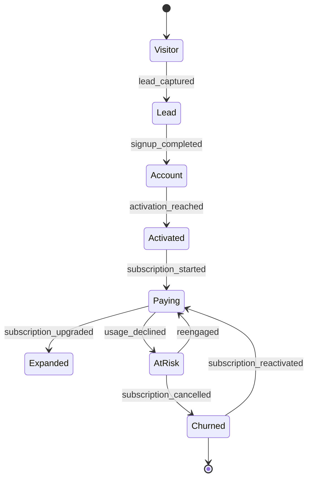
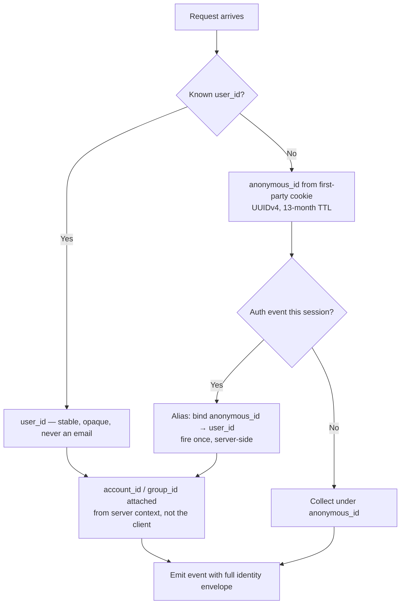

# How to Think About Events

A method, not a checklist. It takes about two hours per product surface and it replaces about six months of arguing.

---

## The mental model: your product is a state machine

Users move objects through states. That is the entire ontology.



Events are the **edges**. Properties describe the **conditions** of the crossing. Traits describe the **node** the object is currently in.

Once you see the product this way, most taxonomy questions answer themselves:

- *"Should this be an event or a property?"* — Did something cross an edge? Event. Does it describe the current node? Property/trait.
- *"Should this be one event or three?"* — Is it one edge or three?
- *"Where does this belong?"* — Whichever object owns the state.

---

## Step 1 — Enumerate the objects

Not screens. Not features. **Nouns your database has a table for**, plus the nouns your users say out loud.

A typical B2B SaaS:

| Object | Owns states like | Identified by |
|---|---|---|
| `visitor` | anonymous, identified | `anonymous_id` |
| `user` | invited, active, dormant | `user_id` |
| `account` | trial, paying, churned | `account_id` |
| `workspace` / `project` | created, shared, archived | `workspace_id` |
| `subscription` | trialing, active, past_due, cancelled | `subscription_id` |
| `integration` | connected, failing, disconnected | `integration_id` |

If two of your objects have identical state machines, you have one object with a `type` property. Merge them.

---

## Step 2 — Enumerate the transitions

For each object, list every way it changes state. Write them as `object_verb` in past tense. Do not stop to judge whether they are worth tracking — that is step 4.

```
workspace_created
workspace_renamed
workspace_shared
workspace_member_added
workspace_member_removed
workspace_archived
workspace_deleted
```

Two rules while you do this:

1. **Past tense, always.** The event is a record of something that already happened. `workspace_create` is a command; `workspace_created` is a fact. You are logging facts.
2. **The object first.** `workspace_created` sorts next to `workspace_archived` in every schema browser, autocomplete, and dropdown your team will ever open. `created_workspace` sorts next to `created_report` and `created_invoice`, which is useless.

---

## Step 3 — Attach properties by asking "how did this differ?"

For each transition, ask: *two users just did this — how were their two instances different?* Every meaningful difference is a property.

```
export_completed
  ├─ How did it differ?  → different formats     → export_format (enum)
  ├─                     → different sizes       → row_count (integer)
  ├─                     → started elsewhere     → export_surface (enum)
  ├─                     → took longer           → duration_ms (integer)
  └─                     → one failed partway    → status (enum: success | partial | failed)
```

Then subtract. A property earns its place only if it appears in a filter, a breakdown, or a join you can name. Four to eight properties per event is healthy. Fifteen means you are logging a database row, not an event.

**Context properties** (page, device, referrer, session, consent state) are attached globally by the collection layer, not repeated per event. If you find yourself listing `page_url` in an event spec, your context layer is not doing its job.

---

## Step 4 — Apply the three tests

Every candidate event faces three questions. Two failures and it does not ship.

### The Decision Test
> When this number moves, who does what differently?

If the honest answer is "we'd find it interesting", it is Tier 3 with a 90-day expiry — or it is nothing.

### The Reconstruction Test
> Six months from now, can an analyst who has never met me reconstruct what this measures from the name and the property list alone?

`activation_reached` fails until the plan states the definition: *first workspace created with ≥ 3 members within 14 days of signup*. Write the definition into the plan, not into a Slack thread.

### The Duplication Test
> Is this already answerable from events I have?

`pricing_page_viewed` is already a `page_view` with `page_type: pricing`. `csv_exported` is already `export_completed` with `export_format: csv`. Most rejected events fail here, and rejecting them is the single highest-value thing an architect does.

---

## Step 5 — Assign a tier

Tiering is how you allocate reliability budget. Not everything deserves the same rigour, and pretending otherwise means either over-engineering everything or protecting nothing.

| Tier | Definition | Collection | Owner | Monitoring | Change process |
|---|---|---|---|---|---|
| **0** | Reconciles against money, contracts, or law | Server-side, mandatory | Named engineer | Hourly freshness + paged anomaly | RFC + two approvals |
| **1** | Core activation and retention loop | Server or hardened client | Named PM | Daily freshness + alert | RFC + one approval |
| **2** | Feature usage, diagnostics | Client-side acceptable | Feature owner | Weekly dashboard | PR review |
| **3** | Experimental, hypothesis-driven | Anything | Requester | None | PR review, auto-expires in 90 days |

The tier is written into the plan file. It determines who reviews changes, what CI enforces, and what happens at 03:00 when the event stops firing.

---

## Step 6 — Decide identity before you decide anything else

Identity is the one thing that cannot be fixed retroactively. Get it wrong and every cohort, funnel, and retention curve you build is wrong in a way that is invisible until someone checks.



Four rules that survive contact with reality:

1. **`user_id` is opaque and permanent.** Not an email, not a username, not a row number that gets reused after a hard delete.
2. **`account_id` comes from the server.** Client-side account resolution breaks the moment a user belongs to two workspaces.
3. **Alias once, server-side.** Firing an alias on every page load produces identity graphs that merge unrelated users through shared devices.
4. **B2B is group-first.** Your revenue lives on the account, so your retention, expansion, and churn metrics are account-scoped. A user-scoped retention curve in a B2B product is a vanity chart.

---

## Step 7 — Write it down in the machine-readable plan

The plan lives at [`../tooling/tracking-plan.json`](../tooling/tracking-plan.json) and is validated in CI. Prose documentation is generated *from* it, never the other way around.

Minimum record per event:

```jsonc
{
  "name": "workspace_created",
  "tier": 1,
  "owner": "pm.growth@example.com",
  "description": "A workspace row was committed. Fires once per workspace, server-side, post-commit.",
  "trigger": "POST /v1/workspaces returns 201",
  "source": "server",
  "properties": [
    { "name": "workspace_id",   "type": "string",  "required": true,  "pii": false },
    { "name": "template_used",  "type": "string",  "required": false, "enum": ["blank", "sales", "support", "custom"] },
    { "name": "member_count",   "type": "integer", "required": true }
  ],
  "destinations": ["ga4", "warehouse"],
  "status": "active",
  "introduced": "2026-02-11"
}
```

---

## Anti-patterns, and what they actually cost

| Anti-pattern | Looks like | Real cost |
|---|---|---|
| **Click-driven taxonomy** | `hero_cta_clicked`, `nav_pricing_clicked` | Rebuild required after every redesign; nothing survives a re-brand |
| **Name explosion** | 340 events, 280 fired < 10 times last month | Nobody can find the 12 that matter |
| **Property smuggling** | `signup_completed_google`, `signup_completed_email` | Every funnel query needs a regex |
| **Screen mirroring** | One event per page, named after the page | Duplicates `page_view`, doubles cost, adds zero information |
| **Silent redefinition** | Trigger condition changed, name kept | Trust in the whole dataset drops, permanently |
| **Vanity funnels** | User-scoped retention in a B2B product | Board deck disagrees with the revenue system |
| **PII drift** | `email` appears in the data layer "temporarily" | A DPIA finding, a deletion project, and a very bad week |

---

## A worked pass, end to end

**Request from the product team:** *"Can we track the new AI assistant?"*

**Step 1 — object.** `assistant_session`. It has states: opened, prompted, answered, accepted, abandoned.

**Step 2 — transitions.**
```
assistant_opened
assistant_prompt_submitted
assistant_response_received
assistant_response_accepted
assistant_session_ended
```

**Step 3 — properties.** How do two sessions differ? Entry point, prompt length, model latency, whether the output was used, why it ended.

**Step 4 — tests.**
- `assistant_opened` — Decision test: passes (drives placement decisions). Duplication test: passes.
- `assistant_prompt_submitted` — passes; carries `prompt_length_chars`, `prompt_source`.
- `assistant_response_received` — passes; carries `latency_ms`, `status`, `token_count`. This is the reliability metric engineering will actually page on.
- `assistant_response_accepted` — passes. **This is the value event.** Everything else is a funnel step leading here.
- `assistant_session_ended` — fails the Decision test as a standalone. Fold into `assistant_response_received` as `is_final` plus an `end_reason` property on the last event. **Rejected.**

**Step 5 — tier.** Tier 2, promoted to Tier 1 if the assistant becomes part of the activation definition.

**Result:** four events, not fourteen. Each with a named owner, a definition, and an expiry review date.

That is the whole method.

---

**See also:** [Tracking principles](tracking-principles.md) · [Data minimalism](data-minimalism.md) · [Product events](../event-taxonomy/product-events.md)
